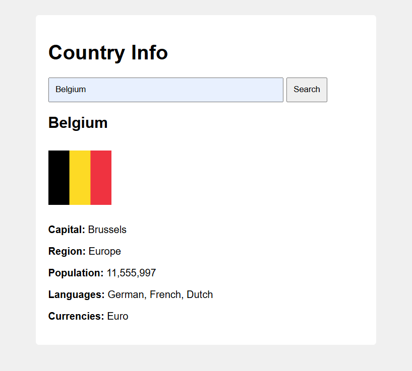
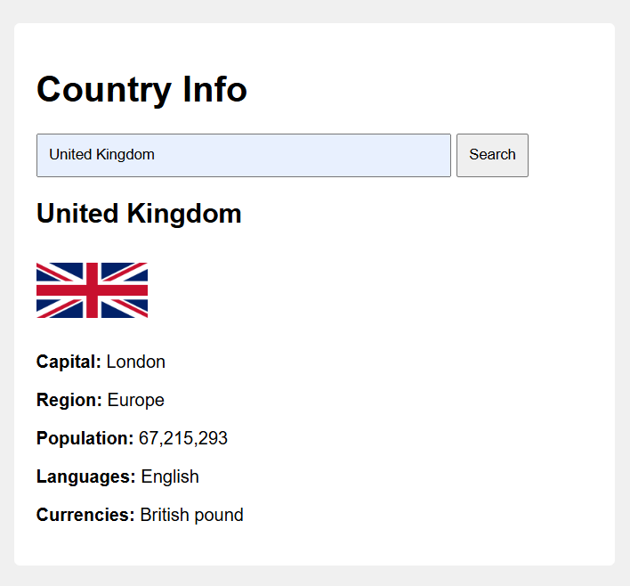
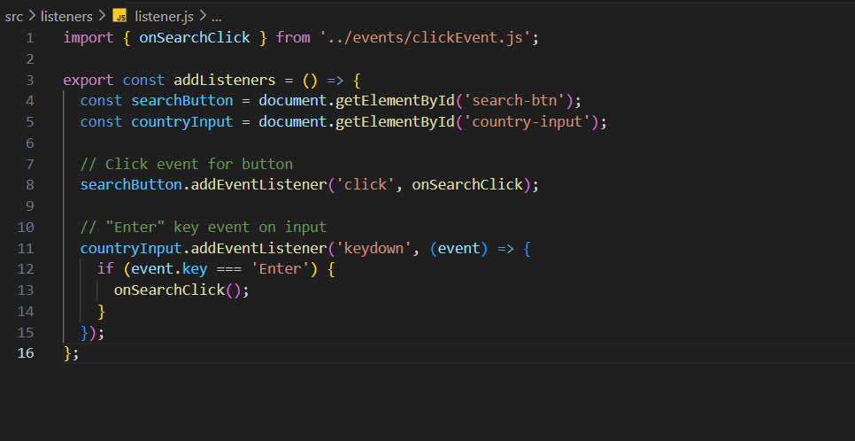

# Country-Info

> The **Country-Info** project uses the REST Countries API to provide detailed and real-time information about any country. With a clean and responsive interface, it displays data such as population, capital, region, languages, currencies, and national flag in a user-friendly format.

- [Country-Info](#country-info)
  - [General Info](#general-info)
  - [Screenshots](#screenshots)
  - [Code Example](#code-example)
  - [Technologies](#technologies)
  - [Status](#status)
  - [Inspiration](#inspiration)
  - [Contact](#contact)

---

## General Info

> This project helps users learn about different countries by simply entering the country name. It fetches structured data using the REST Countries API and renders it dynamically in the browser. The project is a great way to practice working with APIs, asynchronous JavaScript, modular code architecture, and DOM manipulation.

---

## Screenshots

---

## Code Example

---

## Technologies

- HTML5
- CSS3 (Flexbox / Grid)
- JavaScript (ES Modules)
- [REST Countries API](https://restcountries.com/)
- Git & GitHub
- VS Code (Editor)

---

## Status

**Project Completed**

---

## Inspiration

Built as part of the Brussels **FED course** at **HackYourFuture**.  
Aimed to improve skills in asynchronous JavaScript, modular file organization, and API integration.

---

## Contact

**Sajid Hussain**  

 [GitHub Profile](https://github.com/SajidHussainabbasi)

---
