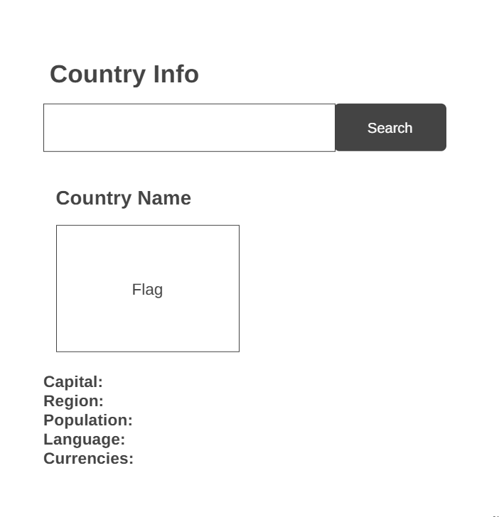

# Design

## Project's Design Overview

The **Country-Info** web application offers users a clean, simple, and responsive interface to explore detailed information about countries around the world. It fetches and displays key data from the [REST Countries API](https://restcountries.com/), including population, capital, region, languages, currencies, and flags.

- **Minimal & Accessible UI**: A straightforward layout focused on clarity and ease of use.
- **Responsive Layout**: Adapts well across devices, from mobile to desktop.
- **Modular Architecture**: Uses separated concerns for data fetching, UI rendering, event handling, and configuration.
- **User-Centered Interaction**: Allows country lookup via both button click and "Enter" key, providing a smooth user experience.

---

## Wireframe 
